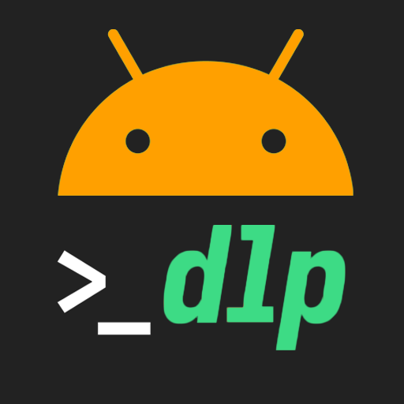
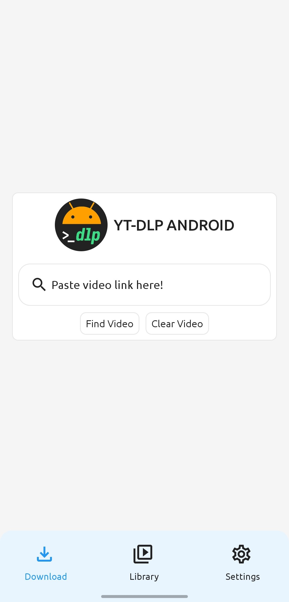
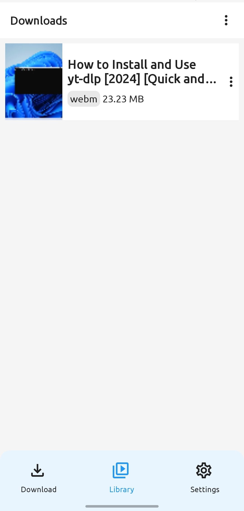
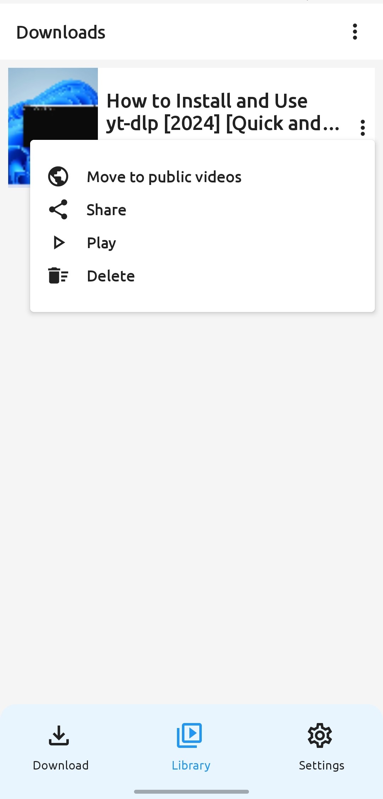
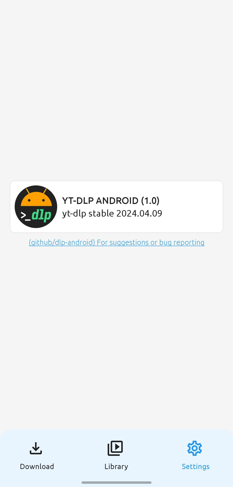

# YT-DLP Android  
#### Android user interface for [yt-dlp](https://github.com/yt-dlp/yt-dlp). 
> yt-dlp is a feature-rich command-line audio/video downloader with support for thousands of sites.

###### Download the app from [Releases](https://github.com/Ma7moud3ly/dlp-android/releases/latest).

## Screenshots:
<div>

&nbsp;&nbsp;&nbsp;

</div>
<br>
<div>

&nbsp;&nbsp;&nbsp;

</div>
<br>
<div>

&nbsp;&nbsp;&nbsp;

</div>

### How To build
YT-DLP Android hosts and pacakges [yt-dlp](https://github.com/yt-dlp/yt-dlp) python library in an android app by using [Chaquopy](https://chaquo.com/chaquopy/)
> Chaquopy provides everything you need to include Python components in an Android app.

Before building YT-DLP Android you need to configure python path in ```app/build.gradle.kts```
```
chaquopy {
    defaultConfig {
        buildPython("<path to python>")
        version = "<python_version>"
    }
}
```
For more about ```chaquopy``` plugin configuration, please check this doc https://chaquo.com/chaquopy/doc/current/android.html


### Inspired by 
- https://github.com/yt-dlp/yt-dlp
- https://chaquo.com/chaquopy/
